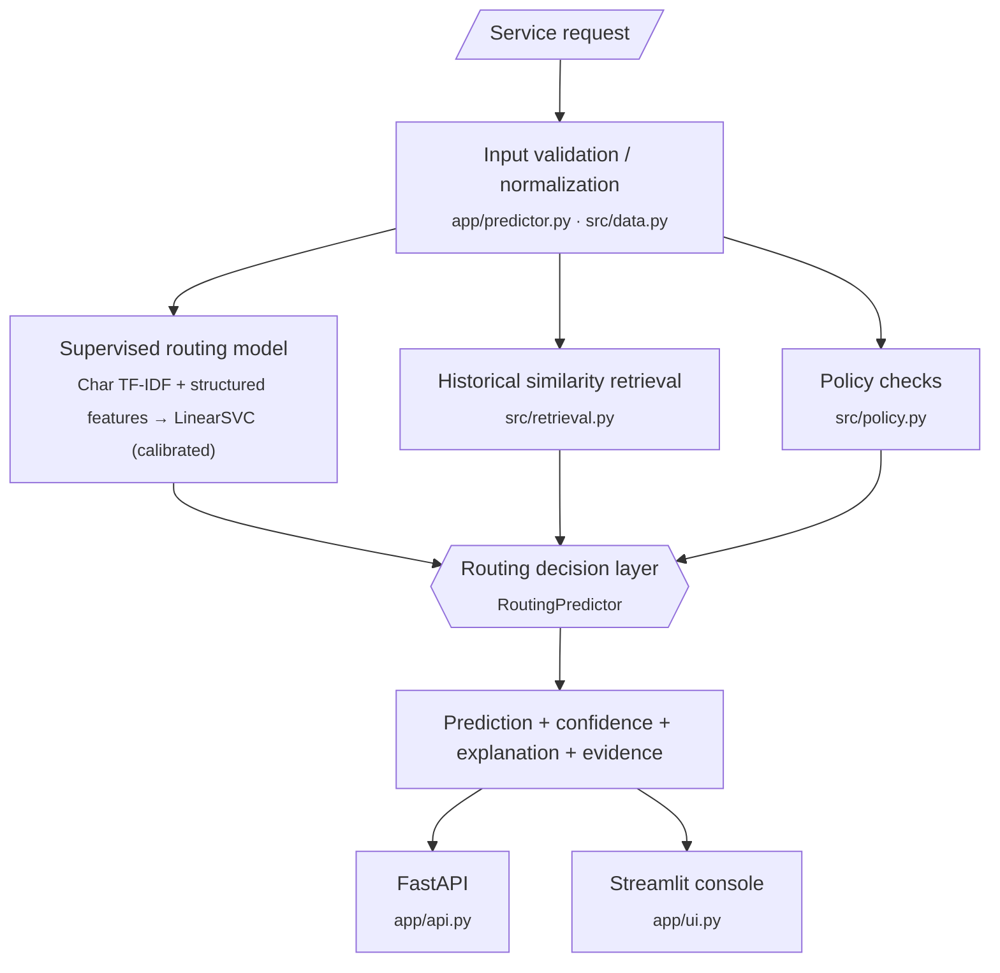

# 🧭 Kestrel Routing Intelligence

**Local Routing Intelligence Platform for Kestrel Home Service Requests**

Predicts which of Kestrel's 7 operational teams should handle a new inbound service request, with a confidence score, a human-readable explanation, and supporting historical evidence. Trained against `final_team`, the team that actually resolved each request. Exposed through a FastAPI service and a Streamlit operations console.

<hr align="left" width="300">

`PYTHON | 3.12` `SCIKIT-LEARN | ML` `FASTAPI | BACKEND` `STREAMLIT | FRONTEND`
`PANDAS | DATA` `PYTEST | 28 PASSED` `LOCAL INFERENCE | NO PAID API`

`STATUS | INTERNSHIP SUBMISSION`

<hr align="left" width="300">

## 📖 Contents

[Key Metrics](#-key-metrics) · [Overview](#-overview) · [Label Decision](#-the-critical-label-decision) · [Architecture](#-architecture) · [Data Quality](#-data--data-quality) · [Model](#-model) · [Evaluation](#-evaluation-methodology) · [Results](#-results) · [Error Analysis](#-error-analysis) · [API](#-api) · [Streamlit Console](#-streamlit-console) · [Repository Structure](#-repository-structure) · [Quick Start](#-quick-start) · [Testing](#-testing) · [Reproducibility](#-reproducibility) · [Limitations](#-limitations) · [Recommendation](#-recommendation) · [Cost](#-cost) · [Security](#-security--data-handling) · [Deliverables](#-submission-deliverables)

<hr align="left" width="300">

## 📊 Key Metrics

All model metrics come from the **temporal holdout** (2026-04-01 → 2026-06-30) and are measured against **`final_team`**, the team that actually resolved each request.

| Metric | Value |
|:--|:--:|
| **Model accuracy** (temporal holdout) | **84.59%** |
| **Model macro F1** | **0.8462** |
| **Legacy bot accuracy** against `final_team` | 77.17% |
| **Legacy bot misroute rate** | 22.83% |
| Holdout requests | 2,135 |
| Model errors | 329 |

> **Note:** 84.59% does **not** meet the originally discussed 90% bar. See [Results](#-results) and [Recommendation](#-recommendation).

---

## 🎯 Overview

Kestrel Home Appliances runs a service desk across IVR, chat, WhatsApp and email. A vendor routing bot currently assigns each new request to one of 7 teams, and agents transfer requests that land in the wrong place. This project evaluates a **locally-run classifier** as an alternative to that bot.

For each request, the system:

- **Predicts** the operational team, trained against `final_team`
- **Scores confidence** and flags ambiguous cases for human review
- **Explains** the prediction in human-readable reasons
- **Shows historical evidence** from similar past requests
- **Exposes** both a FastAPI service and a Streamlit operations console

**Pain points raised by Kestrel's ops team** (Meenal Joshi), per the assignment's email thread:

- Requests that mention payment are wrongly landing in Billing.
- Product breakdowns are landing in Filters & Consumables.
- Low-information requests (e.g. "please call me about my purifier") cannot be routed from text alone.
- Transfers consume a large share of the service desk's day.

Finance (Farhan Sheikh) asked for the new system's ongoing cost in writing before the ₹3.2 lakh/year bot licence is switched off. See [Cost](#-cost).

---

## 🔑 The Critical Label Decision

> **`team_label` is not ground truth.** `train.csv` ships a `team_label` column, but it is the **legacy bot's own initial routing decision**. It was confirmed identical to `resolution_log.first_team` for all 10,822 rows.
>
> **This project trains against `final_team`**, the team that actually closed the request after any agent transfers. Training on `team_label` would reproduce the bot's own routing behaviour, including its bugs.

| | `team_label` | `final_team` |
|---|---|---|
| **What it represents** | The legacy bot's routing guess at request creation | The team that actually resolved the request |
| **Source** | `train.csv` (= `resolution_log.first_team`, 1:1 on all 10,822 rows) | `resolution_log.csv` |
| **Available at prediction time?** | Yes, but it is the thing being replaced | No. It is the outcome, known only afterwards |
| **Used as a model feature?** | **Never** | N/A (it is the *target*) |
| **Used as the prediction target?** | No | **Yes** |

**Why it matters:** `team_label` disagrees with `final_team` on about **22.8%** of requests, and the disagreement is biased on payment mentions. 66% of such requests are routed to Billing, but only 23% actually belong there.

Full evidence trail: `reports/validation_report.md` §2.

---

## 🏗 Architecture



> FastAPI and Streamlit both call the **same `RoutingPredictor` class**. Prediction logic is never duplicated.

| Component | Role |
|---|---|
| **Supervised routing model** | `LinearSVC` on character TF-IDF + structured features, wrapped in `CalibratedClassifierCV` |
| **Historical retrieval** | TF-IDF similarity over past requests (sentence-transformer optional) |
| **Policy checks** | Explanatory signals. A tested hard override exists but is **disabled by default** |
| **Decision layer** | `RoutingPredictor` combines the above into one response |

---

## 🧹 Data & Data Quality

### Data files

| File | Purpose |
|---|---|
| `data/train.csv` | 10,822 historical requests, 2025-04-01 to 2026-06-30, incl. legacy `team_label` |
| `data/resolution_log.csv` | `first_team` / `final_team` / `transfers` / `resolved_at` per request (`final_team` = actual target) |
| `data/test_unlabelled.csv` | 2,178 requests to score, 2026-07-01 to 2026-09-30, no labels |
| `data/teams.csv` | Team scopes and the 2026-01-15 rename mapping |
| `data/sample_submission.csv` | Expected output format for scoring `test_unlabelled.csv` |

### Team taxonomy

`Installs & Demo` · `Repairs` · `Filters & Consumables` · `Billing` · `Returns & Replacement` · `Warranty Claims` · `Product Advice`

### Data-quality work

| Issue found | Handling |
|---|---|
| **Team renames mid-history** (`Installations` → `Installs & Demo`, `Consumables` → `Filters & Consumables`, on 2026-01-15) | Cleanly split with no overlap. Names are **canonicalized automatically** |
| **Mojibake from a legacy Zoho export** (e.g. `é`, `…`) in about **4.4%** of rows | Targeted replacement and normalization in `src/data.py`, plus whitespace normalization |
| **`team_label` ≠ ground truth** | Verified 1:1 against `resolution_log.first_team`. The target is derived from `final_team` instead |
| **Post-resolution information** | `resolution_log` outcomes are kept **out of the model features**. Operations analytics read from it separately |
| **Legacy-Zoho timestamps in UTC, not IST** | Corrected in `src/ops_analytics.py` for **analytics only**, never for modelling |
| **Missing values / exact duplicates** | None found |

> **No leakage:** resolution outcomes (`final_team`, `transfers`, `resolved_at`) are never fed into the routing model as features. `final_team` is used only as the target.

Full detail: `reports/validation_report.md` §1.

---

## 🧠 Model

**Character TF-IDF `(3,5)`-grams + structured features → `LinearSVC` → `CalibratedClassifierCV`**

| Choice | Rationale |
|---|---|
| **Character n-gram TF-IDF** | Robust to spelling mistakes, abbreviations, noisy service-request text, and legacy encoding corruption |
| **`LinearSVC`** | Fast to train, suited to sparse text features, runs on CPU with no GPU or external API, and is interpretable at the team-scope level |
| **`CalibratedClassifierCV`** (sigmoid / Platt scaling, internal 5-fold CV) | Produces calibrated probabilities rather than raw decision-function values, which drive the confidence score |
| **No LLM in the routing path** | Inference is fully local and has no per-request API cost |

Four experiments are compared in `src/train.py` (see `reports/model_comparison.csv`), and the final model is trained on the full training data.

---

## 🧪 Evaluation Methodology

| Evaluation | Role | Details |
|---|---|---|
| **Temporal holdout** | **Primary** | Train on 2025-04-01 → 2026-03-31 (**8,687** rows). Evaluate on the untouched 2026-04-01 → 2026-06-30 holdout (**2,135** rows) |
| **Stratified random split** | Secondary robustness check only | Same rows, reported for comparison |
| **Production model** | Shipped artifact | Refit on **all** of `train.csv` |
| **`test_unlabelled.csv` scoring** | Inference only | 2,178 unlabelled requests scored into `predictions.csv`. **No metrics** are reported on it |

Every reported metric comes from the **temporal-holdout-only** model, not the refit production model. Full methodology: `reports/validation_report.md`.

---

## 📈 Results

| | Accuracy vs `final_team` | Macro F1 |
|---|:--:|:--:|
| **Routing model** (temporal holdout, 2,135 requests) | **84.59%** | **0.8462** |
| **Legacy bot** (same target) | 77.17% | n/a |

- On the same `final_team` target, the routing model achieved 84.59% accuracy versus 77.17% for the legacy bot.
- It **does not meet the originally discussed 90% bar**. That figure was framed against the legacy bot's own, biased labels. `MEMO.md` explains why match-rate against `final_team` is the operationally meaningful metric.
- The gap to the 90% threshold is why the recommendation is a [shadow-mode pilot](#-recommendation) rather than immediate replacement.

**Related artifacts:** `reports/model_comparison.csv` · `reports/per_team_metrics.csv` · `reports/confusion_matrix.png`

---

## 🔍 Error Analysis

**329 of 2,135** holdout requests (15.4%) were misrouted. They are categorized in `reports/error_analysis.csv`.

| Finding | Detail |
|---|---|
| **Dominant category (≈76% of errors)** | Genuinely insufficient request text, e.g. "please call back regarding purifier". This matches the ops team's own complaint |
| **Lowest-precision team** | Repairs (approximately 0.79 precision) |
| **Confidence behaviour** | Confidence is bimodal rather than smoothly graded. A few wrong predictions are confidently wrong |

Low-information requests cannot be fixed by any text classifier. The system surfaces `confidence`, `confidence_band`, `margin`, a `runner_up` and a `review_required` flag so that ambiguous cases can go to human review instead of being presented as certain.

Full breakdown: `reports/validation_report.md` §7.

---

## 🔌 API

```bash
uvicorn app.api:app --reload --port 8000
```

| Endpoint | Purpose |
|---|---|
| `POST /predict` | Route a single request |
| `GET /health` | Liveness check |

Missing optional fields (e.g. `product_family`) degrade gracefully. An empty or missing `request_text` returns `422` with a clear message.

**Request**

```bash
curl -X POST http://localhost:8000/predict \
  -H "Content-Type: application/json" \
  -d '{"request_text": "My water purifier is leaking from the bottom",
       "product_family": "Water Purifier", "warranty_status": "in_warranty",
       "channel": "whatsapp"}'
```

**Response**

```json
{
  "predicted_team": "Repairs",
  "confidence": 0.94,
  "confidence_band": "high",
  "review_required": false,
  "margin": 0.91,
  "runner_up": {"team": "Returns & Replacement", "confidence": 0.03},
  "reasons": ["The request contains the signal word(s) \"leak\", \"leaking\".", "..."],
  "similar_cases": [{"request_text": "...", "team": "Repairs", "similarity": 0.87}]
}
```

---

## 🖥 Streamlit Console

```bash
streamlit run app/ui.py
```

| Page | What it does |
|---|---|
| **Route Request** | Single-request routing with explanation and historical evidence |
| **Operations** | Workload, transfer friction, monthly volume and resolution time, from `resolution_log.csv` (never fed into the model) |
| **Model Performance** | Experiment comparison, per-team metrics, confusion matrix, error categories |
| **About / Model Card** | Renders `MODEL_CARD.md` |

---

## 🗂 Repository Structure

```
kestrel-routing/
├── app/                      # thin front-end layer
│   ├── api.py                # FastAPI service (POST /predict, GET /health)
│   ├── predictor.py          # shared RoutingPredictor, the single prediction path
│   └── ui.py                 # Streamlit ops console (4 pages)
├── src/                      # modelling, evaluation and supporting logic
│   ├── data.py               # loading, mojibake cleanup, target derivation, temporal split
│   ├── features.py           # TF-IDF + structured feature encoders
│   ├── train.py              # experiment comparison + final model training
│   ├── evaluate.py           # confusion matrix, per-team metrics, confidence bands
│   ├── error_analysis.py     # error categorization on the temporal holdout
│   ├── predict.py            # scores test_unlabelled.csv -> predictions.csv
│   ├── policy.py             # explanatory + (disabled-by-default) tested policy rule
│   ├── retrieval.py          # historical similarity (TF-IDF, sentence-transformer optional)
│   ├── explanations.py       # human-readable reason generation
│   └── ops_analytics.py      # workload/friction analytics, separate from the model
├── models/                   # generated artifacts (gitignored)
├── reports/                  # generated reports/CSVs/plots
├── tests/                    # pytest suite
├── data/                     # supplied CSVs (gitignored, see Security)
├── README.md · MEMO.md · MODEL_CARD.md · submission-form.md · SCREEN_RECORDING_SCRIPT.md
└── requirements.txt · pyproject.toml · .gitignore · .env.example
```

---

## 🚀 Quick Start

**1. Create the environment and install dependencies**

```bash
python -m venv .venv
pip install -r requirements.txt
```

**2. Activate the virtual environment**

```bash
# macOS / Linux
source .venv/bin/activate

# Windows (PowerShell)
.\.venv\Scripts\Activate.ps1
```

**3. Add the data**

Place the 5 supplied CSVs into `data/` (filenames in [Data & Data Quality](#-data--data-quality)).

**4. Run the pipeline**

```bash
python -m src.train              # trains all 4 experiments + final model, writes models/ and reports/model_comparison.csv
python -m src.evaluate           # confusion matrix, per-team metrics, confidence bands
python -m src.error_analysis     # reports/error_analysis.csv
python -m src.predict            # scores data/test_unlabelled.csv -> predictions.csv (repo root)
uvicorn app.api:app --reload     # API on :8000
streamlit run app/ui.py          # ops console
```

<details>
<summary><b>Optional: semantic retrieval</b></summary>

<br>

No external model download is required. Retrieval uses TF-IDF by default. An optional `sentence-transformers` line is commented out in `requirements.txt`. If enabled, it downloads `all-MiniLM-L6-v2` from the Hugging Face hub on first use, and the code falls back to TF-IDF automatically if that is unavailable.

</details>

---

## ✅ Testing

```bash
pytest tests/ -v
```

**28 passed, 1 warning.** The warning is an unrelated `httpx`/Starlette deprecation notice, not a project issue.

<details>
<summary><b>What the tests cover</b></summary>

<br>

- Text preprocessing
- Temporal split correctness
- Target-label sanity (`final_team` vs `team_label`)
- Policy-signal generation
- The (disabled-by-default) hard override and its empirical evaluation
- Predictor schema, validation and missing-field handling
- Retrieval fallback
- FastAPI request/response behaviour, including error cases
- The `predictions.csv` submission-artifact schema

All tests execute real code paths against the actual trained model artifacts.

</details>

---

## 🔁 Reproducibility

- Fixed random seed (**42**) throughout.
- The full chain regenerates every number in this README, `MEMO.md`, `MODEL_CARD.md` and `reports/` from the supplied CSVs, deterministically:

```bash
python -m src.train && python -m src.evaluate && python -m src.error_analysis && python -m src.predict
```

- No paid external API is required anywhere in the pipeline.

---

## ⚠️ Limitations

| Limitation | Detail |
|---|---|
| **Insufficient request text** | About 76% of holdout errors. No classifier can resolve these from text alone |
| **Below the requested 90% target** | Temporal holdout accuracy is 84.59% |
| **Confidence is bimodal** | A few wrong predictions are confidently wrong |
| **Repairs precision** | Repairs has the lowest precision (approximately 0.79) |
| **Historical data quality** | Team renames, about 4.4% mojibake and UTC/IST timestamp inconsistencies required cleaning. They were handled, but they are properties of the source data |
| **Retrieval quality** | Depends on TF-IDF rather than semantic embeddings in this environment |
| **Not yet validated operationally** | Results are from local historical evaluation. Shadow-mode validation is needed before any operational replacement |

Full list: `MODEL_CARD.md` → "Known limitations".

---

## 🧭 Recommendation

> **Do not switch off the legacy routing bot immediately.**
>
> The documented recommendation is a **controlled 1–2 week shadow-mode pilot** with human review, monitoring, comparison against the legacy routing process, and an **agreed go/no-go threshold**.

On the same `final_team` target, the routing model achieved 84.59% accuracy versus 77.17% for the legacy bot, but it falls short of the originally discussed 90% bar, so live-traffic evidence is needed before replacing the existing process. Full discussion: `MEMO.md`.

---

## 💰 Cost

| Item | Value |
|---|---|
| Paid model/API inference cost (this evaluation) | **₹0 per request** (fully local, no external LLM or paid API) |
| Legacy bot licence, for comparison | **₹3.2 lakh/year** |
| Hosting, storage, monitoring, engineering maintenance | Real but deployment-dependent. Not estimated here |

Full breakdown and friction-cost discussion: `MEMO.md`.

---

## 🔒 Security & Data Handling

This repository is public. The supplied customer and operational data is **not** part of it.

- `.gitignore` excludes all supplied CSVs, generated model artifacts, and the client-data-derived `predictions.csv`, so none of these are committed.
- To reproduce results, place the supplied CSVs into `data/` locally (see [Quick Start](#-quick-start)).
- Example text in this README and other docs is drawn from the assignment's own worked example, not raw customer PII.

---

## 📦 Submission Deliverables

| Category | Files |
|---|---|
| **Documentation** | `README.md` · `MEMO.md` · `MODEL_CARD.md` · `submission-form.md` · `SCREEN_RECORDING_SCRIPT.md` |
| **Reports** | `reports/validation_report.md` · `reports/model_comparison.csv` · `reports/per_team_metrics.csv` · `reports/confusion_matrix.png` · `reports/error_analysis.csv` |
| **Predictions** | `predictions.csv` (scored `test_unlabelled.csv`, repo root, gitignored as client-data-derived) |
| **Code** | Full `app/` + `src/` implementation |
| **Tests** | `tests/` (28 passing) |
| **Config** | `requirements.txt` · `.gitignore` |

---

*Internship submission · Implemented, locally validated, and tested*
